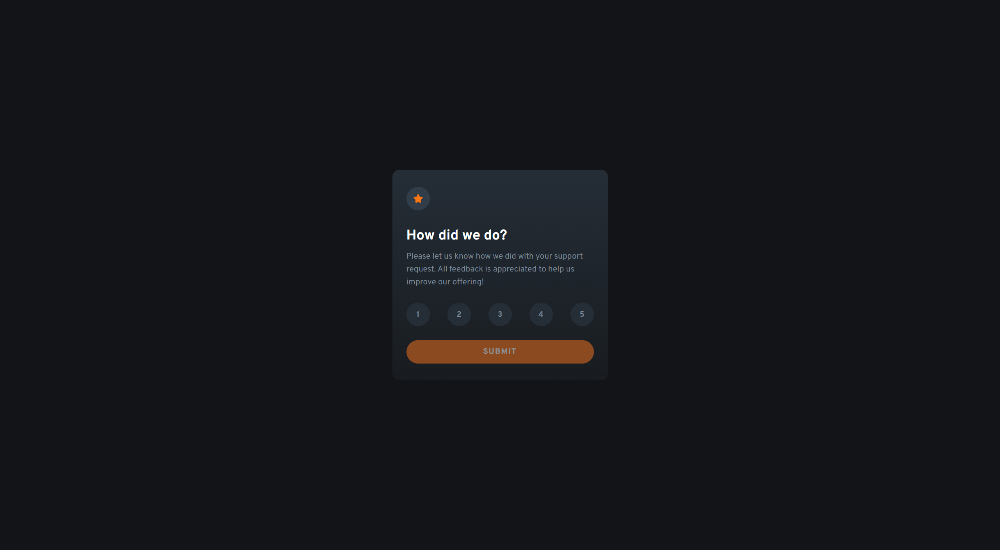

# Frontend Mentor - Interactive rating component solution

This is a solution to the [Interactive rating component challenge on Frontend Mentor](https://www.frontendmentor.io/challenges/interactive-rating-component-koxpeBUmI). Frontend Mentor challenges help you improve your coding skills by building realistic projects.

## Table of contents

- [Overview](#overview)
  - [The challenge](#the-challenge)
  - [Screenshot](#screenshot)
  - [Links](#links)
- [My process](#my-process)
  - [Built with](#built-with)
  - [What I learned](#what-i-learned)
- [Author](#author)

**Note: Delete this note and update the table of contents based on what sections you keep.**

## Overview

### The challenge

Users should be able to:

- View the optimal layout for the app depending on their device's screen size
- See hover states for all interactive elements on the page
- Select and submit a number rating
- See the "Thank you" card state after submitting a rating

### Screenshot



### Links

- Solution URL: [Add solution URL here](https://github.com/KH-Ray/interactive-rating-component)
- Live Site URL: [Add live site URL here](https://lively-duckanoo-5a1f31.netlify.app)

## My process

### Built with

- Semantic HTML5 markup
- CSS custom properties
- Flexbox
- CSS Grid
- [Svelte](https://svelte.dev/) - Free and open-source front-end component framework

### What I learned

```svelte
<main class="main">
  <div class="box-placement">
    <div class="box">
      {#if !thankYouPage}
        <div class="first-row">
          
        </div>
        <div class="second-row">
          <h1>How did we do?</h1>
          <p>
            Please let us know how we did with your support request. All
            feedback is appreciated to help us improve our offering!
          </p>
        </div>
        <div class="third-row">
          <button
            on:click={setScore}
            class:button-active={Number(selectedBtn?.value) === 1}
            value={1}>1</button
          >
          <button
            on:click={setScore}
            class:button-active={Number(selectedBtn?.value) === 2}
            value={2}>2</button
          >
          <button
            on:click={setScore}
            class:button-active={Number(selectedBtn?.value) === 3}
            value={3}>3</button
          >
          <button
            on:click={setScore}
            class:button-active={Number(selectedBtn?.value) === 4}
            value={4}>4</button
          >
          <button
            on:click={setScore}
            class:button-active={Number(selectedBtn?.value) === 5}
            value={5}>5</button
          >
        </div>
        <div class="fourth-row">
          <button on:click={setThankYouPage} disabled={score === 0}
            >SUBMIT</button
          >
        </div>
      {:else}
        <div class="illustration-box">
          
          <p class="score">You selected {score} of 5</p>
        </div>
        <div class="thank-you-msg-box">
          <p><strong>Thank you!</strong></p>
          <p class="thank-you-msg">
            We appreciate you taking the time to give a rating. If you ever need
            more support, don't hesitate to get in touch!
          </p>
        </div>
      {/if}
    </div>
  </div>
</main>
```

## Author

- Frontend Mentor - [@KH_Ray](https://www.frontendmentor.io/profile/KH-Ray)
